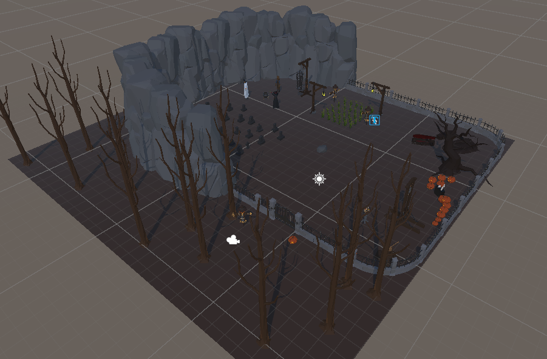
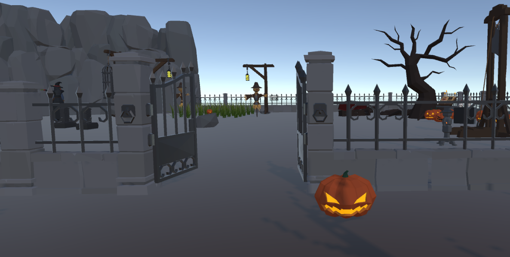
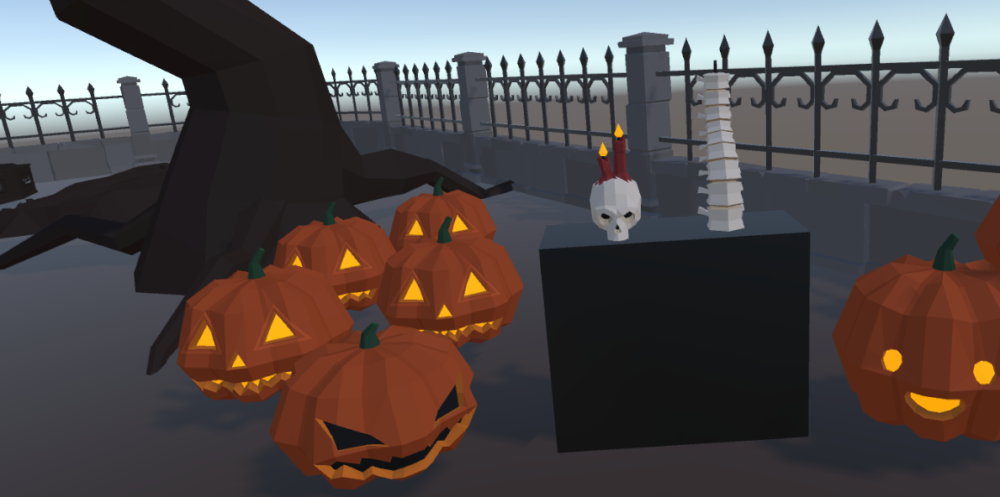
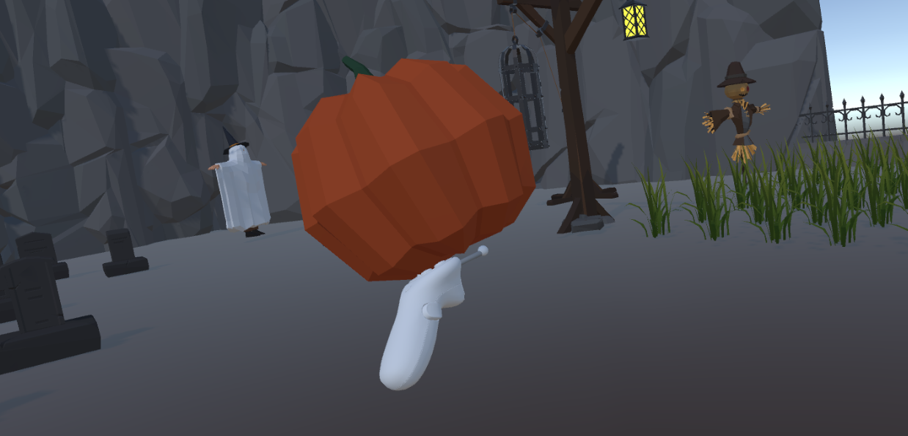
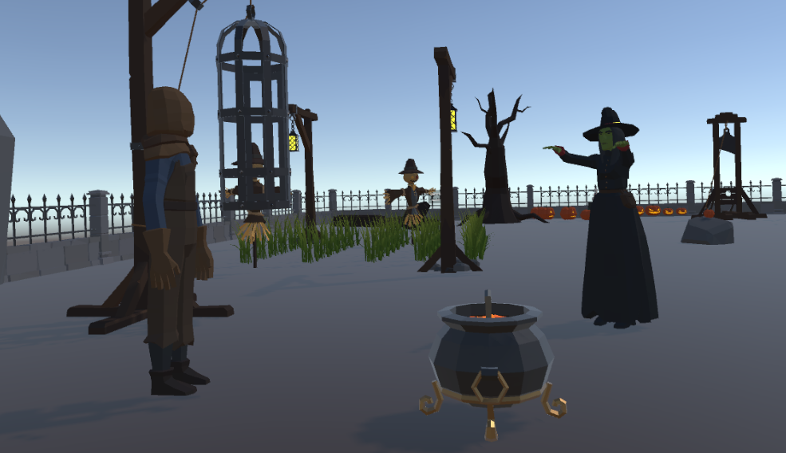
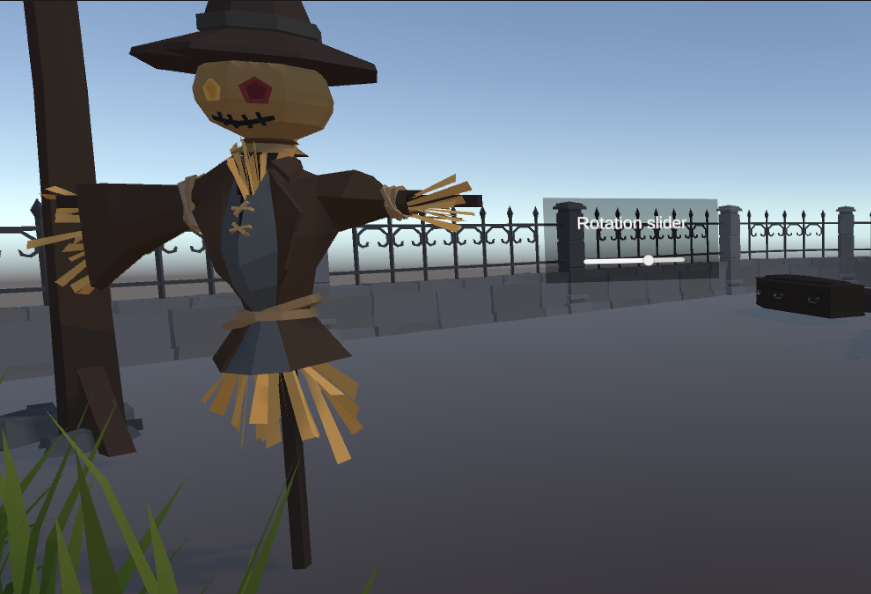
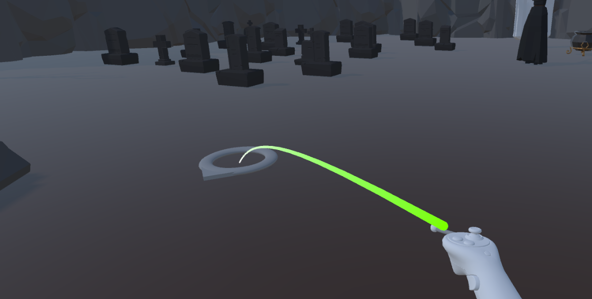

# Lab2 Assignment
This project is done as part of the Lab 2 assignment for IMTC 505 course.
Unity 2022.3.46f1 is used.

The scene is constructed with the Halloween theme, using thwe following assets pack: 

https://assetstore.unity.com/packages/3d/props/poly-halloween-236625

 
## Description
The goal of this project was to implement several interactive elements within VR and to be able to interact with them. Please refer to the Table of Content an d the subsequest sections for further details. As for the VR headset - Meta Quest 2 was used for debugging and the final application deployment.

If you'd like to try it out - just clone the repository and it should be good to go (make sure to check that the platform is switched to Android). The application testing was limited to Meta Quest 2.

This implementation can serve as basis for a VR quest / puzzle game (or like an espace room) with the Halloween theme.

 ## Video Demo
The video demonstrates all of the created elements in the project: https://youtu.be/S62Rw_BuyLM

## Table of Contents
- [Animation](#animation)
- [Gaze based](#gaze)
- [Grabbable](#Grabbable)
- [UI slider](#UI-slider)
- [Teleportation](#teleportation)
- [Main challenges](#main-challenges)
- [Useful Tutorials](#useful-tutorials)

## Animation
A gates opening animation is implemented. An invisible box collider is added that is triggered when a player apporaches the gates. The door opening animation is played only once during the runtime. 

## Gaze
Gaze based interactions in this demo are showecased through the candles lighting. Specifically, one carved pumpkin, and spine & skull candles lit up when player's gaze at these objects is detected. 

## Grabbable
Ability to grab objects seems essential. Therefore, in this demo a small pupkin is spawned on the stone in the middle of the scene - it can be picked up and thrown by the player. If the position of the pumpkin is altered (from its origin) and it hasn't been moved for 5 seconds - it destroys and re-spawns. Similarly, if the player manages to throw it outside of the gameplay area - it will re-spawn. 

One of the interesting interactions with this pumpkin is that after hitting the cauldron in the scene 5 times, it will lit up (or i.e. it will turn from empty to full of potion).

## UI slider

In order to understand how the basic UI elements can be used within the VR scene, this slider UI is added to the scene. It allows to rotate the scarecrow for 180 degrees to either side.

## Teleportation

Teleportation was added as well as the whole Locomotion system. In terms of the teleportation area - it is limited only within the walls of the scene. When choosing the place to teleport to, the player can also adjust with joystick the direction they wish facing when teleported.

## Main challenges
- Locomotion system. In order to build a properly immersive and interactive experience, the ability to move around seems essential. Especially, when you are limited in your physical space, the implementation of the locomotion system that allows to use joysticks to move around is required. And I think it was one of the biggest challenges for me. I tried to fully set it up on my own using the prefabs provided by XR Interactive Toolkit. However, at some point when I was implementing object grabbing, the XR Interaction Manager would throw a NUll error. Eventually, I ended up importing the XR Setup (including all interactors, controllers, and the XR origin) as a prefab from the package, and then things worked as needed.
- Animation. After implementing the gates opening animation, I relalized how much effort it takes. And although some animation may not be difficult in implementation, it is very time consuming. Particularly, if you consider doing animation for some characters - perhaps it might be easier to do in Blender, than Unity.

## Useful Tutorials:
As part of the assignment, I'd like to acknowledge the following tutorials that were very helpful in the learning process: 
- https://www.youtube.com/watch?v=cxRnK8aIUSI
- https://www.youtube.com/watch?v=8xIxXkXn26M
- https://www.youtube.com/watch?v=SfQS9lfRRm0
- https://www.youtube.com/watch?v=yhB921bDLYA
- https://www.youtube.com/watch?v=dZQYMNXojOs&t
